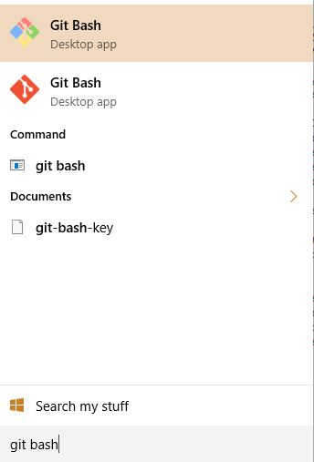
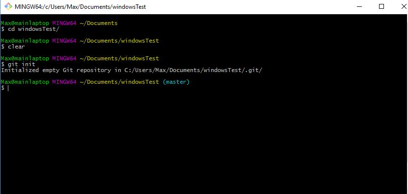
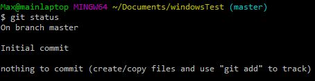
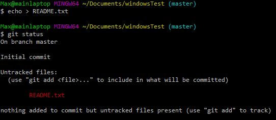
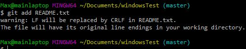
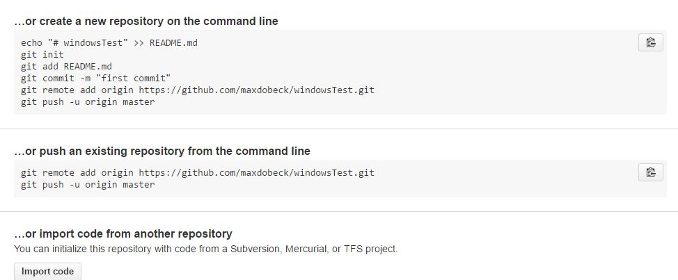
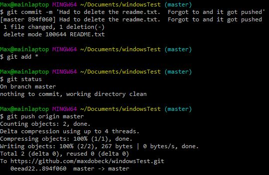

# Summary:
After moving from a Linux environment to an Enterprise Windows environment I've found that I need to be more flexible in my software and tool usage.  In that spirit I've been following the guide that [Git has put out] (https://git-scm.com/book/en/v2/Git-Basics-Recording-Changes-to-the-Repository).  The following is a step-by-step guide in case I ever need a reference for setting up a Windows workstation.

## Installation
After considering running Git through a Sublime package I found that setting up the basic command line interface to be the easiest path to version control nirvana.  With one centralized place for Git access I could use any IDE or text editor for any set of files and then return to the command line to push it to the repository.

I downloaded the Git for Windows to essentially be a bash terminal command line interface.  Currently I'm running [version 2.8.1](https://git-for-windows.github.io/).  I chose most of the defaults for the installation which will give you the Shell integration and the GUI.  Both seem like they have their places and could be easier to use in certain situations.  For instance, you can right click from any windows explorer session and launch the GUI or the bash-like command line interface.

## Git Setup
###### Launching
During installation you may have created a shortcut to the git bash shell or you may have opted to use the native Windows command prompt.  I will be using the Git provided bash-like shell.  You can launch it by either searching for "Git Bash" or launching the desktop icon you created.

###### Initializing 
After navigating and/or creating the desired directory you will need to initialize the Git repository.  This is the barebones of a git repository and should NOT be done if you are cloning an existing repository.  This is only for starting a brand new repository.

Execute `$git init` as shown below.  You will see extra files created if you run `ls -a`.

###### Status
The `git status` command is useful when you've started tracking multiple changes or if you've forgotten the last time you've commited.  In this case there are no files and thus nothing has happened.  You should see the same output as below.

###### Creating and Tracking Files
`git add` can be used in conjuction with the `*` wildcard to grab filetypes like `*.rb` to grab specific files.  Or you can manually specify a file.  In most cases you'll want to simply upload the all files and subdirectories with `git add *`.

Below I've created an empty text file using the `echo` command.  Followed by the `git status` we can see that the file is not tracked and we are prompted to track the file.

Here we start the tracking of the empty text file README.txt by specifying the file name.  The command `git add *` would have done the job as well.

###### Committing
Committing changes is the critical step before pushing them to a repository.  This is referred to as "staging" and is used in conjuction with `git status` to see which files have and have not been tracked for a push.

This commit will be run with the ` -m 'Text comment goes here'` option.  Otherwise your default editor will open and you will be forced to leave a comment.  This way you do not leave the command line.  Changing the default editor is an alternative to running with the `-m ` option.

At this point you should stop and setup the repository on Github if you haven't already.  There are instructions there but they will be posted below.  You should also take the time to setup an SSH key with your account.

###### Putting it all together
We've used
[`git init`](#Initializing)

[`git add`](Creating and Tracking Files)

[`git status`](#Status)

[`git commit`](Committing)

We haven't pushed to our repository yet and it is still looking empty.  But lets say I realized that I need to change the README.txt to a README.md but I've already tracked the README.txt file!  Well git has a handy way of removing and moving files: `git rm README.txt`.  This is of course interchangeable with the `git mv README.txt README.md`  but in this case I delete the README.txt and created the '.md' file separately.

Below I've also tied together the whole string of commands to show what committing after those changes looks like.

